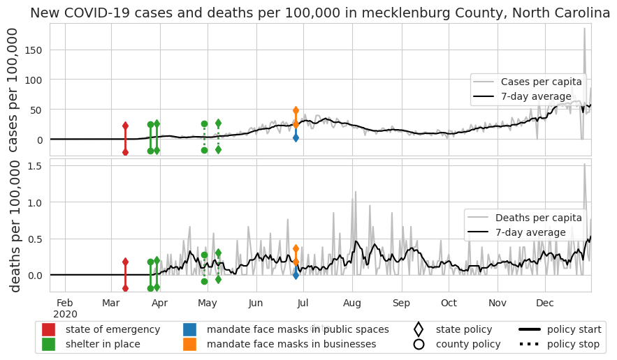

# Covid-19 Correlation Analysis

This started as my first ever python project - trying to make some simple visualizations on covid data. The results of this first attempt are in [Notebook 3]. Over the years, it's blown up into attempts to wrangle and analyze data in different ways as I pick up more data science tools. The primary objective of this project is to find **which policy types had the biggest impact in the overall course of the pandemic**. 

## Project Evolution

### Phase 1: Basic Visualizations

- **Goal**: Create simple visualizations of COVID-19 data.

- **Outcome**: End results from this effort are documented in [Notebook 3].

### Phase 2: Average Impact

- **Goal**: Quantify the change in cases / deaths $n$ days after a policy was implemented.

- **Description**: Pool all state and county-level data. For each policy type, look at all instances where that policy was put in place and record the average change in cases / deaths some number of days after it was put in place.

- **Outcome**: I was able to identify 2 policies that may have had a significant impact. Details in [Notebook 4]

### Phase 3: Regression with Bins
- **Goal**: Use a regression model with dummy variables representing the time since a policy was implemented to quantify policy impact.

- **Description**: Join case and policy datasets by creating dummy variables that represent time ranges since a policy took effect. Use the distribution of these bins along with model type as the target of hyperparameter tuning experiments to find the best way to encode these bins.

- **Outcome**: Hundreds of input features made fitting models computationally expensive and results unconvincing and difficult to interpret. This attempt is in the archive folder of this project.

### Phase 4: Focused Linear Regression
- **Goal**: Apply only linear regression models and dummy variables that represent a single policy to make the hyperparameter tuning in phase 3 faster.

- **Outcome**: Found numerous policies with significant p-values. However, I faced challenges with analyzing a vast array of bin structures and the lack of interaction terms between policies left a lot on the table in terms of performance

### Phase 5: Time series and refined regression models

- **Goal**:  Explore time series models (ARIMA) and re-think old regression approaches to find better ways to explore the results

- **Outcome**: This phase is in progress.

## Data Sources

- **Case and Death Data**: dataworld / https://data.world/associatedpress/johns-hopkins-coronavirus-case-tracker/workspace/file?filename=2_cases_and_deaths_by_county_timeseries.csv

- **Policy Data**: https://catalog.data.gov/dataset/covid-19-state-and-county-policy-orders-9408a

## Notebooks Overview

### 00: Summary
high level-overview of the methodology used and current results.

### 01: EDA on cases and deaths
Identifying the data cleaning steps for the covid dataset.

### 02: EDA on policy data

Identifying the data cleaning steps for the policy dataset.

### 03: Some basic plots
This notebook was the original goal of this project. I started this shortly after I started learning python and these plots were one of the first things I tried to make.

### 04: Analyzing changes
Here, I'm studying the average change in cases and deaths 14 days after a policy was implemented. I found that 'aca special enrollment period - start' and 'suspend elective dental procedures - start' seemed to have the most significant impact. However, I knew when reflecting on this approach that there was a better way that I hadn't found yet.

### 05: Running the first round of linear regression
This notebook is more of a script to run the models described in my third approach. The actual discussion is in notebook 6. 

### 06: Analyzing first round of regression results
Looking through the R-squared and p-values for each of the linear models built for a single policy on a few different date distributions.

### Dev - time series
Development notebook where I'm testing ARIMA models.

# Setup

- Clone the project: `git clone git@github.com:apalermo01/Covid-19-correlation-analysis.git`
- cd into the project and make a new environment: `python -m venv env` (for linux)
- activate the environment:
    - `source ./env/Scripts/activate` for bash
    - `. ./env/bin/activate/fish` for fish
- install dependencies: `pip install -r requirements.txt`
- install the project as a package: `pip install --editable .`
- run `python main.py` to download and clean the dataset
